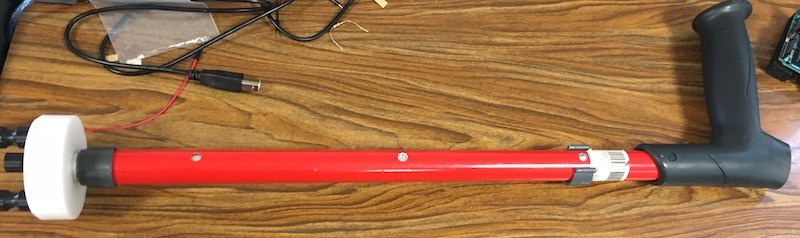

# Dispositif d'ouverture de porte
Ce dispositif permet l'ouverture d'une porte standard pour un usager en fauteuil électrique.



## Liens
 * [documentation du projet](https://docs.humanlab.me/myhumankit/dispositif-douverture-de-porte)
 * [page d'accueil du projet sur le GesLab](https://dev.humanlab.me/projet/dispositif-douverture-de-porte/)
 * [page wiki du projet sur le wiki du Humanlab](http://wikilab.myhumankit.org/index.php?title=Projets:Dispositif_douverture_de_porte)


## Fonctionnalités
Ce dépôt GitHub est principalement utilisé pour stocker l'ensemble des informations (documents, modèles 3D, code, plans, etc.) nécessaires au projet _Dispositif d'ouverture de porte_.

Le fichier _project.json_ permet notamment de générer la documentation finale du projet à l'aide de l'outil [myworkshop](https://github.com/myhumankit/myworkshop).

## Installation
[Téléchargez ce dépôt](https://github.com/myhumankit/dispositif-douverture-de-porte/archive/master.zip) et décompressez le dans le répertoire de votre choix. Renommez le dossier `dispositif-douverture-de-porte-master` en `dispositif-douverture-de-porte`.

Il est possible de cloner directement ce dépôt dans le répertoire de votre choix :

```
$ git clone git@github.com:myhumankit/dispositif-douverture-de-porte.git
```

## Briques technologiques utilisées
 * [myworkshop](https://github.com/myhumankit/myworkshop).

## Gestion de version
La gestion de version repose sur le système [SemVer](http://semver.org/). Voir le fichier [CHANGELOG.md](CHANGELOG.md) pour plus de détails.

## Contribuer
Si vous souhaitez contribuer au projet, merci de créer une _issue_ ou de _forker_ ce projet et de créer une nouvelle branche. Toutes les _pull requests_ sont les bienvenues !

## Licence
Ce projet est diffusé sous la licence MIT. Voir le fichier [LICENSE](LICENSE) pour plus de details.

## Contributeurs
 * **Julien Lebunetel** - [jlebunetel](https://github.com/jlebunetel)

---

# Dispositif d'ouverture de porte

## Links
 * [Documentation page of the project](https://docs.humanlab.me/myhumankit/dispositif-douverture-de-porte)
 * [Home page of the project on GesLab](https://dev.humanlab.me/projet/dispositif-douverture-de-porte/)
 * [Page of the project on the wiki of the Humanlab](http://wikilab.myhumankit.org/index.php?title=Projets:Dispositif_douverture_de_porte)


## Features
This very GitHub repository is used to collect all available information (documents, 3D models, code, blueprints, etc.) regarding the project _Dispositif d'ouverture de porte_.

The _project.json_ file allows the final documentation generation using the tool [myworkshop](https://github.com/myhumankit/myworkshop).

## Installation
[Download this repository](https://github.com/myhumankit/dispositif-douverture-de-porte/archive/master.zip) and unzip it into the Arduino libraries folder on your computer. You should rename the folder `dispositif-douverture-de-porte-master` in `dispositif-douverture-de-porte`.

Or clone the repository directly in the Arduino libraries folder:

```
git clone git@github.com:myhumankit/dispositif-douverture-de-porte.git
```

## Technologie used
 * [myworkshop](https://github.com/myhumankit/myworkshop).

## Versioning
We use [SemVer](http://semver.org/) for versioning. See the [CHANGELOG.md](CHANGELOG.md) file for details.

## Contributing
If you'd like to contribute, please raise an issue or fork the repository and use a feature branch. Pull requests are warmly welcome.

## Licensing
The code in this project is licensed under MIT license. See the [LICENSE](LICENSE) file for details.

## Contributors
 * **Julien Lebunetel** - [jlebunetel](https://github.com/jlebunetel)
